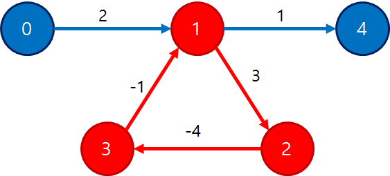

# 벨만-포드 알고리즘
Bellman-Ford Algorithm

### 다익스트라의 한계
**다익스트라**</br> 
시작점에서 순차적으로 가장 가까운 점을 찾아가며 모든 점과의 최단 거리를 찾는 알고리즘.


다익스트라는 `음수 가중치가 존재하는 상황`에선 사용 불가합니다.</br>
다음과 같은 음수 사이클이 형성될 시 무한히 갱신되는 상황이 발생되기 때문이죠.



2번 노드까진 성공적으로 갱신되나, 3번을 통해 다시 1번을 갱신하는 순간 1번의 값이 더 적어지며 다시 2번을 갱신하게 되고, 무한히 이 과정을 반복하게 됩니다.

이런 문제를 극복하기 위해 제안된 알고리즘이 바로 `벨만-포드 알고리즘`입니다.</br> (**\*주의!** 나중에 설명드리긴 하겠지만, `벨만-포드 알고리즘`이 음수 사이클이 존재함에도 최단거리를 찾을 수 있는 것은 아닙니다.)

### 벨만-포드 알고리즘
벨만 포드 알고리즘은 `다익스트라` 알고리즘과 거의 비슷합니다. 순서는 다음과 같습니다.
```
1. 각 정점과의 거리를 INF로 초기화
2. 출발 지점을 설정한 후, 출발지점까지의 거리를 0으로 초기화
3. 아래 과정을 V-1회 (V: 노드의 수) 반복
    1. 연결된 간선을 하나씩 모두 탐색한다
    2. 연결된 간선의 시작 지점을 이전에 이미 방문한 경우(start ≠ INF)에만 아래 과정을 거쳐 갱신 여부를 결정한다
    3. 해당 간선을 거치는 것 vs 이미 저장되어있는 경로를 채택하는 것 중, 더 작은 값으로 끝 지점의 최단 경로를 갱신한다.
4. 음수 사이클의 존재 여부를 파악하기 위해선 한번 더 반복한다.
    - 만약 값이 변경된다면 음수 사이클이 존재한다는 것.
```

한번이라도 거리를 갱신한 모든 점들에 대해서 **`매번`** 갱신을 진행하는 것이 `다익스트라` 알고리즘과의 차이점입니다.

다익스트라는 한번 방문한 점에 대해선 값을 갱신하진 않지만, 벨만 포드는 매번 이를 갱신함으로서 음의 가중치로 인해 정점의 비용이 줄어드는 상황을 감지합니다.

이미 저장된 경로에 대해서 값이 갱신되는 경우에만 값을 저장하기에 음수 사이클이 존재하지 않는다면 V-1 회 반복하였을 시 다익스트라와 같이 V-1회 반복한다면 더 이상의 최소비용의 갱신이 일어날 수 없습니다.

그렇기에 만약 1회 더 반복시 (V회) 값이 갱신되었다면 이는 음수 사이클이 존재한다는 의미이기도 합니다.

### 코드
**Python**
```python

INF = int(1e9) # 무한대 값

# 벨만-포드 알고리즘
def bellmanFord(start):
    # 시작 노드에 대해서 초기화
    distance[start] = 0
    # v번 edge relaxation을 반복.
    # v - 1번 탐색하고 마지막 한번은 Negative cycle 존재 확인
    for i in range(v):
        # 매 반복마다 모든 간선을 확인하며 갱신
        for j in range(e):
            curNode, nextNode, edgeCost = edges[j]
            # 현재 간선을 거쳐서 다른 노드로 이동하는 거리가 더 짧은 경우
            if distance[curNode] != INF and distance[curNode] + edgeCost < distance[nextNode]:
                distance[nextNode] = distance[curNode] + edgeCost
                # v번째 반복에서 갱신되는 값이 있으면 Negative cycle 존재
                if i == v - 1:
                    return False

    # 벨만-포드 정상종료
    return True

```

**C++**
```C++
void Bellman_Ford()
{
    Dist[1] = 0;
    for (int i = 1; i <= N - 1; i++)
    {
        for (int j = 0; j < Edge.size(); j++)
        {
            int From = Edge[j].first.first;
            int To = Edge[j].first.second;
            int Cost = Edge[j].second;
 
            if (Dist[From] == INF) continue;
            if (Dist[To] > Dist[From] + Cost) Dist[To] = Dist[From] + Cost;
        }
    }
 
    for (int i = 0; i < Edge.size(); i++)
    {
        int From = Edge[i].first.first;
        int To = Edge[i].first.second;
        int Cost = Edge[i].second;
 
        if (Dist[From] == INF) continue;
        if (Dist[To] > Dist[From] + Cost)
        {
            cout << "음의 사이클이 존재하는 그래프입니다." << endl;
            return;
        }
    }
    cout << "음의 사이클이 존재하지 않는, 정상적인 그래프 입니다." << endl;
}

```

